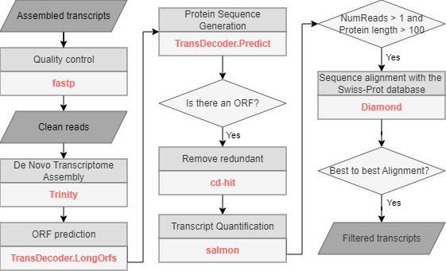

# Trinity Annotation Pipeline

A comprehensive Python package for transcriptome assembly, annotation, and quantification using Trinity, TransDecoder, Salmon, and DIAMOND.



## Features

This pipeline includes 8 steps:

0. **Download UniProt database** - Download Swiss-Prot protein database
1. **Quality control and merge FASTQ files** - Run fastp quality control and merge samples
2. **Trinity assembly** - Assemble transcriptome using Trinity
3. **TransDecoder** - Predict coding sequences (CDS) and proteins
4. **Salmon quantification** - Quantify transcript expression
5. **Filter low expression** - Filter out low-expressed genes
6. **DIAMOND bidirectional best hit** - Annotate proteins using DIAMOND
7. **Generate final files** - Create filtered CDS, PEP, BED, and GFF3 files

## Installation

### Prerequisites

The following external tools need to be installed and available in your PATH:

- **fastp** - For quality control of sequencing data
- **Trinity** - For transcriptome assembly
- **TransDecoder** - For ORF prediction
- **Salmon** - For transcript quantification
- **DIAMOND** - For protein sequence alignment

### Install the Package

```bash
# Clone or download the package
cd trinity_annotation_pipeline

# Install the package
pip install .

# Or install in development mode
pip install -e .
```

### Install Dependencies

```bash
pip install -r requirements.txt
```

## Usage

### Running the Complete Pipeline

Run all steps with a single command:

```bash
trinity-pipeline -i input_raw_fastq -s Paca
```

With custom parameters:

```bash
trinity-pipeline -i input_raw_fastq -s Paca \
    --work-dir ./work \
    -t 20 \
    --max-workers 2 \
    --memory 100G
```

### Running Individual Steps

Each step can be run independently:

#### Step 0: Download UniProt database
```bash
trinity-download-uniprot
```

#### Step 1: Quality control and merge FASTQ files
```bash
trinity-cat-fastq -i input_raw_fastq -s Paca -o output_1_cat_and_fastq
```

#### Step 2: Trinity assembly
```bash
trinity-assembly -s Paca -i output_1_cat_and_fastq -o output_2_trinity -t 8
```

#### Step 3: TransDecoder
```bash
trinity-transdecoder -i output_2_trinity/trinity_multi_out.Trinity.fasta -o output_3_TransDecoder
```

#### Step 4: Salmon quantification
```bash
trinity-salmon -c output_3_TransDecoder/trinity_multi_out.Trinity.fasta.transdecoder.cds \
    -f output_1_cat_and_fastq -o output_4_salmon
```

#### Step 5: Filter low expression
```bash
trinity-filter-expression -s output_4_salmon \
    -i output_3_TransDecoder/trinity_multi_out.Trinity.fasta.transdecoder.pep \
    -o output_5_select
```

#### Step 6: DIAMOND bidirectional best hit
```bash
trinity-diamond -i output_5_select -o output_6_diamond_b2b
```

#### Step 7: Filter and generate final files
```bash
trinity-filter-results -d output_6_diamond_b2b -s output_5_select \
    -t output_3_TransDecoder -o output_7_height_add_uniprot
```

### Pipeline Options

#### Control which steps to run

```bash
# Start from step 3
trinity-pipeline -i input -s species --start-from 3

# Stop at step 5
trinity-pipeline -i input -s species --stop-at 5

# Skip specific steps
trinity-pipeline -i input -s species --skip-step 0 --skip-step 1
```

#### Customize output directories

```bash
trinity-pipeline -i input -s species \
    --output-1 my_output_1 \
    --output-2 my_output_2 \
    ...
```

#### Thread and memory options

```bash
trinity-pipeline -i input -s species \
    -t 20 \                   # Threads for all steps (default: 20)
    --max-workers 2 \        # Maximum parallel workers (default: 2)
    --memory 100G             # Trinity memory (default: 50G)
```

## Input Requirements

### FASTQ Files

The pipeline expects paired-end FASTQ files with the following naming convention:
- `samplename_1.fastq.gz` - Forward reads
- `samplename_2.fastq.gz` - Reverse reads

Place all FASTQ files in the input directory specified with `-i` or `--input`.

## Output Structure

The pipeline creates the following output directories:

- `output_1_cat_and_fastq/` - Quality controlled and merged FASTQ files
- `output_2_trinity/` - Trinity assembly results
- `output_3_TransDecoder/` - TransDecoder predictions (CDS, PEP, BED, GFF3)
- `output_4_salmon/` - Salmon quantification results
- `output_5_select/` - Filtered high/low expression genes
- `output_6_diamond_b2b/` - DIAMOND alignment results
- `output_7_height_add_uniprot/` - Final filtered files (CDS, PEP, BED, GFF3)

## Configuration

### Default Parameters

- Threads: 20 (applied to all steps)
- Max workers: 15 (for parallel tasks)
- Trinity: 50G memory
- TransDecoder: minimum protein length 50
- Salmon: k-mer size 31
- Expression filtering: threshold = 1 (NumReads)
- DIAMOND: E-value 1e-5

### Customizing Parameters

All parameters can be customized via command-line arguments. See `--help` for each command:

```bash
trinity-pipeline --help
trinity-cat-fastq --help
trinity-assembly --help
# etc.
```

## Troubleshooting

### Common Issues

1. **External tools not found**: Make sure all required tools (fastp, Trinity, TransDecoder, Salmon, DIAMOND) are installed and in your PATH.

2. **Memory issues**: Increase memory allocation for Trinity using `--memory` option.

3. **Thread conflicts**: If you're running multiple steps in parallel, adjust thread counts to avoid overloading the system.

4. **File not found errors**: Ensure previous steps completed successfully and output files exist before running subsequent steps.


## Author

yuzijian (yuzijian@stu.ouc.edu.cn or yuzijian1010@163.com)

## Citation

If you use this pipeline in your research, please cite:

```
Trinity Annotation Pipeline v1.0.0
https://github.com/yuzijian/trinity-annotation-pipeline
```

## Support

For issues and questions, please open an issue on GitHub or contact the author.


